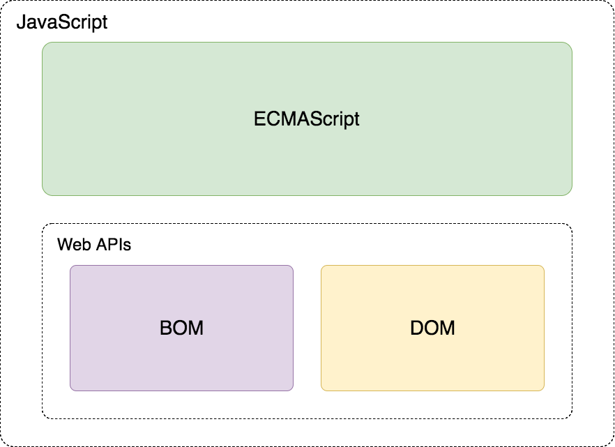
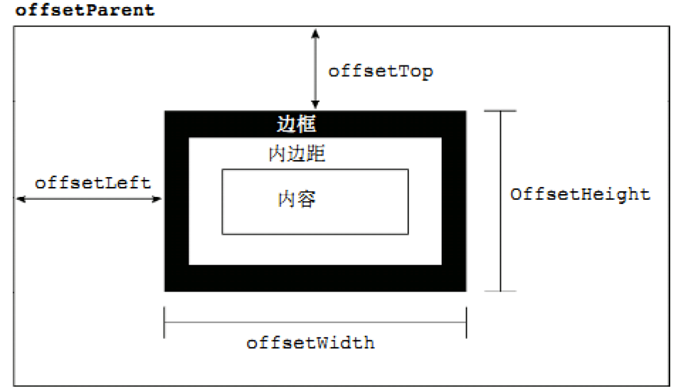

---
学习目标:
  - 掌握API和Web API的概念
  - 掌握常见浏览器提供的API的调用方式
  - 能通过Web API开发常见的页面交互功能
  - 能够利用搜索引擎解决问题
typora-copy-images-to: media
---

# Web API

## Web API介绍

### API的概念

API（Application Programming Interface,应用程序编程接口）是一些预先定义的函数，目的是提供应用程序与开发人员基于某软件或硬件得以访问一组例程的能力，而又无需访问源码，或理解内部工作机制的细节。

- 任何开发语言都有自己的API
- API的特征输入和输出(I/O)
  - var max =  Math.max(1, 2, 3);
- API的使用方法(console.log('adf'))

### Web  API的概念

浏览器提供的一套操作浏览器功能和页面元素的API(BOM和DOM)

此处的Web API特指浏览器提供的API(一组方法)，Web API在后面的课程中有其它含义


### 掌握常见浏览器提供的API的调用方式
[MDN-Web API](https://developer.mozilla.org/zh-CN/docs/Web/API)

### JavaScript的组成



#### ECMAScript - JavaScript的核心

定义了JavaScript 的语法规范

JavaScript的核心，描述了语言的基本语法和数据类型，ECMAScript是一套标准，定义了一种语言的标准与具体实现无关

#### BOM - 浏览器对象模型

一套操作浏览器功能的API

通过BOM可以操作浏览器窗口，比如：弹出框、控制浏览器跳转、获取分辨率等 

#### DOM - 文档对象模型

一套操作页面元素的API

DOM可以把HTML看做是文档树，通过DOM提供的API可以对树上的节点进行操作

## DOM

### DOM的概念

文档对象模型（Document Object Model，简称DOM），是[W3C](https://baike.baidu.com/item/W3C)组织推荐的处理[可扩展标记语言](https://baike.baidu.com/item/%E5%8F%AF%E6%89%A9%E5%B1%95%E7%BD%AE%E6%A0%87%E8%AF%AD%E8%A8%80)的标准[编程接口](https://baike.baidu.com/item/%E7%BC%96%E7%A8%8B%E6%8E%A5%E5%8F%A3)。它是一种与平台和语言无关的[应用程序接口](https://baike.baidu.com/item/%E5%BA%94%E7%94%A8%E7%A8%8B%E5%BA%8F%E6%8E%A5%E5%8F%A3)(API),它可以动态地访问程序和脚本，更新其内容、结构和[www](https://baike.baidu.com/item/www/109924)文档的风格(目前，HTML和XML文档是通过说明部分定义的)。文档可以进一步被处理，处理的结果可以加入到当前的页面。[DOM](https://baike.baidu.com/item/DOM/50288)是一种基于树的[API](https://baike.baidu.com/item/API/10154)文档，它要求在处理过程中整个文档都表示在[存储器](https://baike.baidu.com/item/%E5%AD%98%E5%82%A8%E5%99%A8)中。


把文档抽象成一个对象。


DOM又称为文档树模型


- 文档：一个网页可以称为文档
- 节点：网页中的所有内容都是节点（标签、属性、文本、注释等）
- 元素：网页中的标签（元素节点）
- 属性：标签的属性（属性节点）

### DOM经常进行的操作

- 获取元素
- 对元素进行操作(设置其属性或调用其方法)
- 动态创建元素
- 事件(什么时机做相应的操作)

## 获取页面元素

### 为什么要获取页面元素

例如：我们想要操作页面上的某部分(显示/隐藏，动画)，需要先获取到该部分对应的元素，才进行后续操作

document代表就是整个文档。获取页面元素的时候，要等元素加载后才能获取到，如果在加载前去获取，是为null。一般把script元素放在body的结束标签的前面。

console.dir()用于专门输出对象，不会对对象做任何的处理。

### 根据id获取元素

```javascript
var div = document.getElementById('main');
console.log(div);

// 获取到的数据类型 HTMLDivElement，对象都是有类型的
// 返回了一个对象，它的类型是 HTMLDivElement,在_proto_中可以找到。
```

注意：由于id名具有唯一性，部分浏览器支持直接使用id名访问元素，但不是标准方式，不推荐使用。

### 根据标签名获取元素，返回HTMLcollection 集合、伪数组，跟数组比较类似，但是其本质不是数组。

通过标签获取到的集合是动态集合。就是当 我们获取完这个集合对象之后，如果网页上动态的添加了一个div元素，那这个集合会动态发生改变。

```javascript
var divs = document.getElementsByTagName('div');
for (var i = 0; i < divs.length; i++) {
  var div = divs[i];
  console.log(div);
} 

divs 这个集合里边的元素是一个HTMLDivElement类型的对象。
```

### 根据name属性获取元素，不太推荐使用

```javascript
var inputs = document.getElementsByName('hobby');
for (var i = 0; i < inputs.length; i++) {
  var input = inputs[i];
  console.log(input);
}

getElementsByName  在不同的浏览器其中工作方式不同。在IE和Opera中，在谷歌中没有这个问题， getElementsByName()  方法还会返回那些 id 为指定值的元素（就是跟name同名）。所以你要小心使用该方法，最好不要为元素的 name 和 id 赋予相同的值。 
IE 和 Edge 都返回一个 HTMLCollection, 而不是NodeList 。
截取MDN
```

### 根据类名获取元素*

有浏览器兼容的问题，IE9以后才支持的，用不用要根据用户需求，如果需要兼容到IE8以前的浏览器，那么我们就不可以用这个方法。

```javascript
var mains = document.getElementsByClassName('main');
for (var i = 0; i < mains.length; i++) {
  var main = mains[i];
  console.log(main);
}
```

### 根据选择器获取元素*

query:查询

与指定选择器或选择器组匹配的第一个 [`HTMLElement`](https://developer.mozilla.org/zh-CN/docs/Web/API/HTMLElement)对象。 如果找不到匹配项，则返回`null`。

把选择器写复杂了就可以找到具体的元素。

具有浏览器兼容性问题，IE8以后才支持。在移动端浏览器上就没有问题。就可以只用他们俩，在PC上会有小问题

```javascript
var text = document.querySelector('#text');
console.log(text);

var boxes = document.querySelectorAll('.box');
for (var i = 0; i < boxes.length; i++) {
  var box = boxes[i];
  console.log(box);
}
```

- 总结

```
掌握
	getElementById()
	getElementsByTagName()
了解
	getElementsByName()
	getElementsByClassName()
	querySelector()
	querySelectorAll()跟querySelector()的用法一样，不同点就是它会返回所有找到的选择器。返回的对象是 NodeList 。
```

## 事件

事件：触发-响应机制，当什么时候做什么事情。绝大部分元素都能设置事件。

1、获取按钮

2、给按钮注册事件

### 事件三要素

- 事件源:触发(被)事件的元素，谁触发了事件
- 事件名称: click 点击事件
- 事件处理程序:事件触发后要执行的代码(函数形式)

### 事件的基本使用

```javascript
var box = document.getElementById('box');
box.onclick = function() {
  console.log('代码会在box被点击后执行');  
};
```

### 案例
- 点击按钮弹出提示框
- 点击按钮切换图片

## 属性操作

### 非表单元素的属性

一般表单元素就是可以跟用户进行交互，如文本框，按钮等等，而div、p只是把数据、文本展示出来。

DOM对应着页面上的一些标签，DOM是在内存中的，标签是直接写在页面上的。

一般我们获得DOM对象或者元素的属性，是对应着标签的属性，但是也有例外。

href、title、id、src、className

```javascript
var link = document.getElementById('link');
console.log(link.href);
console.log(link.title);

var pic = document.getElementById('pic');
console.log(pic.src);
```

DOM对象的对应的标签内的class属性的名字叫做className，因为class在js中是关键字，关键字不可以作为变量或者属性的名字。


案例：

​	点击按钮显示隐藏div

​	美女相册

- innerHTML和innerText

获取开始标签和结束标签之间的内容。必须要有开始和结束标签。HTML不是一个单词，他是四个单词。

```javascript
var box = document.getElementById('box');
box.innerHTML = '我是文本<p>我会生成为标签</p>';
console.log(box.innerHTML);
box.innerText = '我是文本<p>我不会生成为标签</p>';
console.log(box.innerText);
```
- HTML转义符

如果要在页面上显示一个尖括号、或者双引号，只能通过转义符，如果直接写符号，浏览器会对它们进行解析。

```
"		&quot;
'		&apos;
&		&amp;
<		&lt;   // less than  小于
>		&gt;   // greater than  大于
空格	   &nbsp;
©		&copy;
```

- innerHTML和innerText的区别

- innerText的兼容性处理


### 表单元素属性

- value 用于大部分表单元素的内容获取(option除外)
- type 可以获取input标签的类型(输入框或复选框等)

下边的这三个用法稍微有区别，html就这三个。

当html中的标签属性，只有一个值的时候，DOM中对应的元素的属性值是布尔类型。

- disabled 禁用属性，它的值就只有disabled（disabled = "disabled"）;只是禁用了普通用户去文本框输入，开发人员能通过js代码方式去修改文本框的值。
- checked 复选框选中属性
- selected 下拉菜单选中属性，只有selected = "selected"

### 案例

- 点击按钮禁用文本框
- 给文本框赋值，获取文本框的值
- 检测用户名是否是3-6位，密码是否是6-8位，如果不满足要求高亮显示文本框
- 设置下拉框中的选中项
- 搜索文本框
- 全选反选

### 自定义属性操作

一般用来命名一些在数据库对应的名字

以下是一些方法。

- getAttribute() 获取标签行内属性，也能获取自定义标签属性的值。
- setAttribute() 设置标签行内属性
- removeAttribute() 移除标签行内属性
- 与element.属性的区别: 上述三个方法用于获取任意的行内属性。

### 样式操作

- 使用style方式设置的样式显示在标签行内
```javascript
var box = document.getElementById('box');
box.style.width = '100px';
box.style.height = '100px';
box.style.backgroundColor = 'red';
```

- 注意

  通过样式属性设置宽高、位置的属性类型是字符串，需要加上px

### 类名操作

- 修改标签的className属性相当于直接修改标签的类名
```javascript
var box = document.getElementById('box');
box.className = 'show';
```

### 案例

- 开关灯
- 点击按钮改变div的背景颜色
- 图片切换二维码案例
- 当前输入的文本框高亮显示
- 点击按钮改变div的大小和位置
- 列表隔行变色、高亮显示
- tab选项卡切换


## 创建元素的三种方式

### document.write()

使用document.write()会把之前的整个页面都覆盖掉，head标签里的内容都会不见。它局限于只能在页面加载的时候去输出。不能在事件中使用，会覆盖掉。用的情况比较少

一般是用在网页中出现那个客服小窗口那里，一般去购买的，别人直接把js挂上去就能使用

```javascript
document.write('新设置的内容<p>标签也可以生成</p>');
```

### innerHTML

网页上的所有东西都是画出来的。每次设置innerHTML的时候，会触发浏览器DOM树会进行重绘，会导致效率问题，需要斤进行优化。

如果用字符串先把内容进行拼接，最后在使用一次innerHTML，这样使得innerHTML就只绘制一次，但是字符串拼接，重新开辟内存，需要耗费时间，因为字符串不可变。


数组只会内存的后面追加空间，而不会重新开辟新的空间

```javascript
var box = document.getElementById('box');
box.innerHTML = '新内容<p>新标签</p>';
```

### document.createElement()


1、首先在内存中创建一个DOM对象

2、此时的对象还不知到放在哪里，把创建的对象放到DOM树中去

3、然后去设置对象的属性（文字，样式...）

```javascript
var div = document.createElement('div');
document.body.appendChild(div);
```

### 性能问题

- innerHTML方法由于会对字符串进行解析，需要避免在循环内多次使用。
- 可以借助字符串或数组的方式进行替换，再设置给innerHTML
- 优化后与document.createElement性能相近


### 案例

- 动态创建列表，高亮显示
- 根据数据动态创建表格

## 节点操作

```javascript
var body = document.body;
var div = document.createElement('div');
body.appendChild(div);

var firstEle = body.children[0];
body.insertBefore(div, firstEle);

body.removeChild(firstEle);

var text = document.createElement('p');
body.replaceChild(text, div);
```

案例：

​	选择水果


在html文件的书写中，回车换行也是一个文本节点。

### 节点属性

- nodeType  节点的类型
  - 1 元素节点
  - 2 属性节点
  - 3 文本节点 
- nodeName  节点的名称(标签名称)
- nodeValue  节点值
  - 元素节点的nodeValue始终是null


### 模拟文档树结构


DOM是一个树形的结构，所以叫做文档树，树里面的所有内容都是节点。

<div> 是一个元素节点

<div id="box"> id 就是一个属性节点

<div id="box">hello<box> hello是一个文本节点

<!-- 这是一个注释 --> 这是一个注释节点。

创建一些具有相同属性的对象。构造函数。

获取对象没有的属性，属性的值是undefined。

DOM文档就是通过这种类似的机制去创建DOM对象。系统自动帮我们去完成这些事情了。

在运行的时候，浏览器内部维护了一棵DOM树。

1、深刻理解DOM

2、了解节点相关的属性，nodeName、nodeType、nodeValue

3、了解节点的层次结构，父节点、子节点、兄弟节点等等。

```javascript
function Node(option) {
  this.id = option.id || '';
  this.nodeName = option.nodeName || '';
  this.nodeValue = option.nodeValue || '';
  this.nodeType = 1;
  this.children = option.children || [];
}

var doc = new Node({
  nodeName: 'html'
});
var head = new Node({
  nodeName: 'head'
});
var body = new Node({
  nodeName: 'body'
})
doc.children.push(head);
doc.children.push(body);

var div = new Node({
  nodeName: 'div',
  nodeValue: 'haha',
});

var p = new Node({
  nodeName: 'p',
  nodeValue: '段落'
})
body.children.push(div);
body.children.push(p);

function getChildren(ele) {
  for(var i = 0; i < ele.children.length; i++) {
    var child = ele.children[i];
    console.log(child.nodeName);
    getChildren(child);
  }
}
getChildren(doc);
```

### 节点层级

 

```javascript
var box = document.getElementById('box');
console.log(box.parentNode);
console.log(box.childNodes);
console.log(box.children);
console.log(box.nextSibling);
console.log(box.previousSibling);
console.log(box.firstChild);
console.log(box.lastChild);
```

- 注意

  childNodes和children的区别，childNodes获取的是子节点，children获取的是子元素

  nextSibling和previousSibling获取的是节点，获取元素对应的属性是nextElementSibling和previousElementSibling获取的是元素

  ​	nextElementSibling和previousElementSibling有兼容性问题，IE9以后才支持


- 总结

```
节点操作，方法
	appendChild()
	insertBefore()
	removeChild()
	replaceChild()
节点层次，属性
	parentNode
	childNodes
	children
	nextSibling/previousSibling
	firstChild/lastChild
```

## 事件详解

### 注册/移除事件的三种方式


监听器就是事件处理函数

addEventListener可以多次注册事件，onclick是赋值，只能赋值一次，多次赋值会有覆盖的情况。

### 参数

`type`

表示监听[事件类型](https://developer.mozilla.org/zh-CN/docs/Web/Events)的字符串。

`listener`

当所监听的事件类型触发时，会接收到一个事件通知（实现了 [`Event`](https://developer.mozilla.org/zh-CN/docs/Web/API/Event) 接口的对象）对象。`listener` 必须是一个实现了 [`EventListener`](https://developer.mozilla.org/zh-CN/docs/Web/API/EventListener) 接口的对象，或者是一个[函数](https://developer.mozilla.org/zh-CN/docs/Web/JavaScript/Guide/Functions)。


```javascript
var box = document.getElementById('box');
box.onclick = function () {
  console.log('点击后执行');
};
box.onclick = null;

box.addEventListener('click', eventCode, false);
box.removeEventListener('click', eventCode, false);

box.attachEvent('onclick', eventCode);
box.detachEvent('onclick', eventCode);

function eventCode() {
  console.log('点击后执行');
}
```

### 兼容代码

```javascript
function addEventListener(element, type, fn) {
  if (element.addEventListener) {
    element.addEventListener(type, fn, false);
  } else if (element.attachEvent){
    element.attachEvent('on' + type,fn);
  } else {
    element['on' + type] = fn;
  }
}

function removeEventListener(element, type, fn) {
  if (element.removeEventListener) {
    element.removeEventListener(type, fn, false);
  } else if (element.detachEvent) {
    element.detachEvent('on' + type, fn);
  } else {
    element['on'+type] = null;
  }
}
```

### 事件的三个阶段

1. 捕获阶段

2. 当前目标阶段

3. 冒泡阶段

   事件对象.eventPhase属性可以查看事件触发时所处的阶段

### 事件对象的属性和方法

- event.type 获取事件类型
- clientX/clientY     所有浏览器都支持，窗口位置
- pageX/pageY       IE8以前不支持，页面位置
- event.target || event.srcElement 用于获取触发事件的元素
- event.preventDefault() 取消默认行为

#### 案例

- 跟着鼠标飞的天使
- 鼠标点哪图片飞到哪里
- 获取鼠标在div内的坐标

### 阻止事件传播的方式

- 标准方式 event.stopPropagation();
- IE低版本 event.cancelBubble = true; 标准中已废弃

### 常用的鼠标和键盘事件

- onmouseup 鼠标按键放开时触发
- onmousedown 鼠标按键按下触发
- onmousemove 鼠标移动触发
- onkeyup 键盘按键按下触发
- onkeydown 键盘按键抬起触发


## BOM

### BOM的概念

BOM(Browser Object Model) 是指浏览器对象模型，浏览器对象模型提供了独立于内容的、可以与浏览器窗口进行互动的对象结构。BOM由多个对象组成，其中代表浏览器窗口的Window对象是BOM的顶层对象，其他对象都是该对象的子对象。

我们在浏览器中的一些操作都可以使用BOM的方式进行编程处理，

比如：刷新浏览器、后退、前进、在浏览器中输入URL等

### BOM的顶级对象window

window是浏览器的顶级对象，当调用window下的属性和方法时，可以省略window
注意：window下一个特殊的属性 window.name

全局变量属于window，是window对象的属性

### 对话框

- alert()
- prompt()
- confirm()

### 页面加载事件

- onload

```javascript
window.onload = function () {
  // 当页面加载完成之后执行
  // 页面加载完成，即是页面上所有的元素创建完毕，并且引用的外部资源下载完毕（外部的js、css、图片等等）
}
在body,结束标签前中script标签中代码，效率会更高，因为它不需要等外部的资源加载完成。

基本是上所有标签也可以有onload事件 
```

- onunload

```javascript
window.onunload = function () {
  // 当用户退出页面时执行，在onunload中所有的对话框都无法使用，此时要卸载了，window对象会被冻结，对话框又是window的方法。此时会阻止对话框
  点击F5刷新界面的时候，先是卸载页面，再重新加载整个界面。
  直接点击关闭就什么都无法看到
}
```

### 定时器

#### setTimeout()和clearTimeout()

在指定的毫秒数到达之后执行指定的函数，只执行一次


setTimeout() 隔一段时间执行，并且只会执行一次。像定时炸弹，炸一次就没了

第一个参数，要执行的函数

第二个参数，间隔的时间，单位是毫秒

返回值是一个整数，是定时器的标识。

setInterval() 隔一段时间执行，并且会重复执行。像闹钟，每天可以循环

参数、返回值跟setTimeout一样。

```javascript
// 创建一个定时器，1000毫秒后执行，返回定时器的标示
var timerId = setTimeout(function () {
  console.log('Hello World');
}, 1000);

// 取消定时器的执行
clearTimeout(timerId);
```

#### setInterval()和clearInterval()

定时调用的函数，可以按照给定的时间(单位毫秒)周期调用函数

```javascript
// 创建一个定时器，每隔1秒调用一次
var timerId = setInterval(function () {
  var date = new Date();
  console.log(date.toLocaleTimeString());
}, 1000);

// 取消定时器的执行
clearInterval(timerId);
```

案例：

```
定时器
简单动画
```

### location 地址、网址对象

location对象是window对象下的一个属性，使用的时候可以省略window对象。

location可以获取或者设置浏览器地址栏的URL。

#### location有哪些成员？

- 使用chrome的控制台查看

- 查MDN

  [MDN](https://developer.mozilla.org/zh-CN/)

- 成员

- location.href = 'http://www.baidu.com'，比较经常使用。

  - assign('http://www.baidu.com') 委派，它的作用跟href的作用一样，可以让页面跳转到指定的地方。他们都可以后退

    reload()，重新加载 refresh F5刷新。

    参数 true表示强制从服务器获取页面。对应 ctrl+F5强制刷新。  

    false 如果浏览器有缓存，直接从缓存获取页面。对应F5刷新。

    replace('http://www.baidu.com') 替换，替换掉地址栏中的地址，但是不记录历史，只有记录历史的话，浏览器后退功能才能用。

  - hash/host/hostname/search/href……

#### URL

统一资源定位符 (Uniform Resource Locator, URL)，就是我们所说的网址

- URL的组成

```
scheme://host:port/path?query#fragment
http://www.itheima.com:80/a/b/index.html?name=zs&age=18#bottom
scheme:通信协议
	常用的http,ftp,maito等，打开本地文件的话为 file协议
host:主机
	服务器(计算机)域名系统 (DNS) 主机名或 IP 地址。
port:端口号
	整数，可选，省略时使用方案的默认端口，如http的默认端口为80。可能显示为空
path:路径
	由零或多个'/'符号隔开的字符串，一般用来表示主机上的一个目录或文件地址。
query:查询
	可选，用于给动态网页传递参数，可有多个参数，用'&'符号隔开，每个参数的名和值用'='符号隔开。例如：name=zs
fragment:信息片断，字符串，锚点.
#: 表示当前页面
```

search会包含 ?name=zs&age=18#bottom 这样的一串数据，通常可以在F12中输出 location来查看

#### 作业

解析URL中的query，并返回对象的形式

```javascript
function getQuery(queryStr) {
  var query = {};
  if (queryStr.indexOf('?') > -1) {
    var index = queryStr.indexOf('?');
    queryStr = queryStr.substr(index + 1);
    var array = queryStr.split('&');
    for (var i = 0; i < array.length; i++) {
      var tmpArr = array[i].split('=');
      if (tmpArr.length === 2) {
        query[tmpArr[0]] = tmpArr[1];
      }
    }
  }
  return query;
}
console.log(getQuery(location.search));
console.log(getQuery(location.href));
```

### history对象

- back()
- forward()
- go()

go(1)，前进一个页面。go(-1)回退一个页面，有多个就写多个

### navigator对象

在chrome上可以模拟手机上浏览页面，服务器端会判断你是手机还是pc端

在pc输入www.baidu.com会自动补上前边的http://

- userAgent，他会记录着浏览器设备的一些信息（浏览器版本号，操作系统信息等等），能够判断出你是移动端还是pc端设备

## 特效

### 偏移量

- offsetParent 它是一个属性，用于获取距离当前元素、最近的、有定位的父级元素。如果没有定位的父元素，此时是body

offsetLeft：距离offsetParent（有定位父级元素）的横向偏移。

offsetWidth：边框 + padding + width

- offsetParent和parentNode的区别

```javascript
var box = document.getElementById('box');
console.log(box.offsetParent);
console.log(box.offsetLeft);
console.log(box.offsetTop);
console.log(box.offsetWidth);
console.log(box.offsetHeight);
```



### 客户区大小

clientLeft：是border-left的宽度

clientTop：是border-top的宽度

clientWidth、clientHeight：包括padding、width，但是不包括边框。

```javascript
var box = document.getElementById('box');
console.log(box.clientLeft);
console.log(box.clientTop);
console.log(box.clientWidth);
console.log(box.clientHeight);
```


### 滚动偏移

```javascript
var box = document.getElementById('box');
console.log(box.scrollLeft)
console.log(box.scrollTop)
console.log(box.scrollWidth)
console.log(box.scrollHeight)
```


### 案例 

- 拖拽案例
- 弹出登录窗口
- 放大镜案例
- 模拟滚动条
- 匀速动画函数
- 变速动画函数
- 无缝轮播图
- 回到顶部  


## 附录

### 元素的类型

